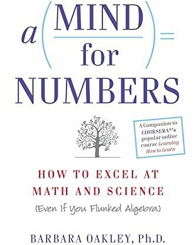
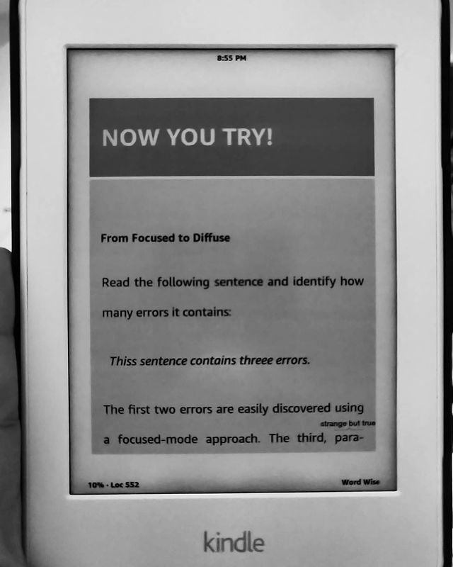
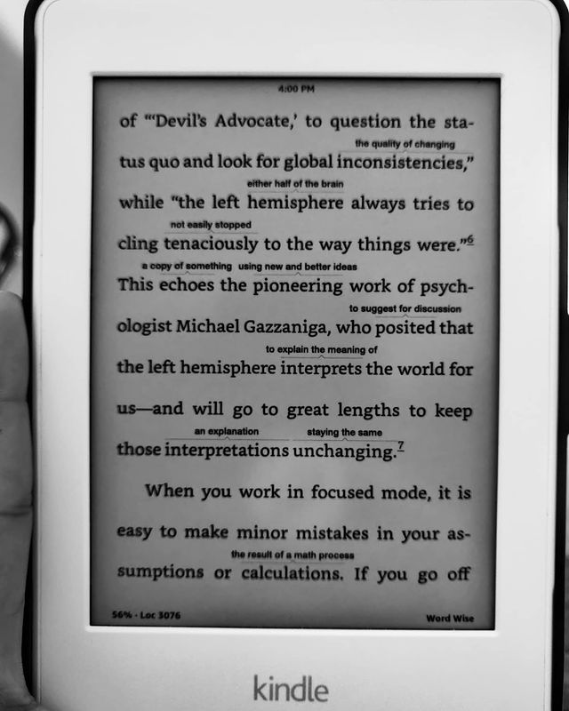

A Mind for Numbers by Barbara Oakley

> ** The process of learning+understanding demystified in a STEM (Science, Technology, Engineering, Mathematics) context. Intellectual and lifestyle tools and processes to learn better.
(A book that is based on "learning how to learn" course on Coursera) **

