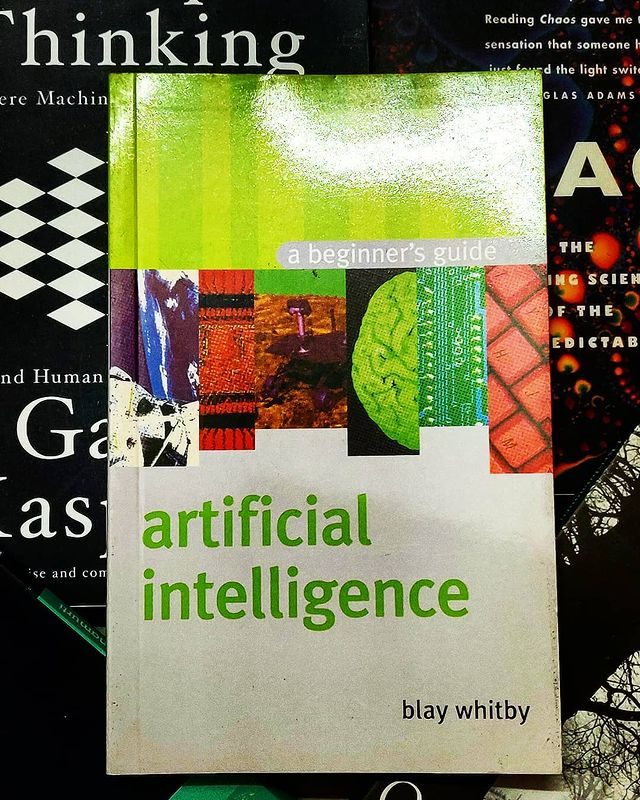

Artificial Intelligence: a beginner's guide by Blay Whitby

> ** What is intelligence? What is artificial intelligence? How can AI do the things it does and why can't it do the things it can't? A gentle introduction to AI. **