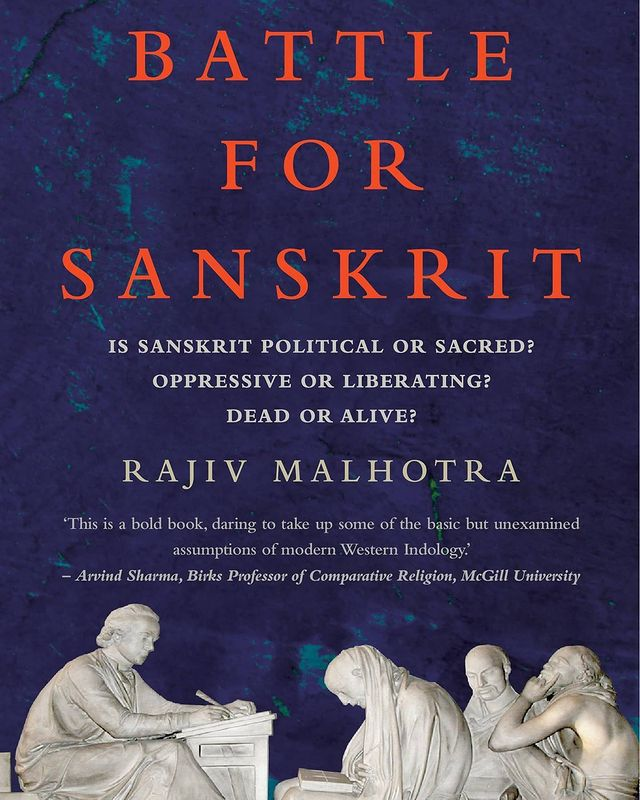
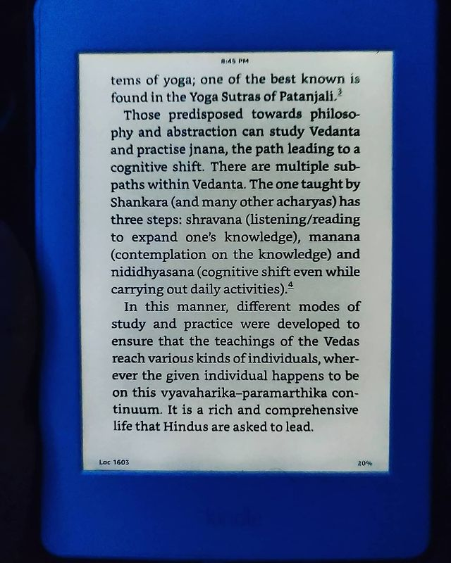
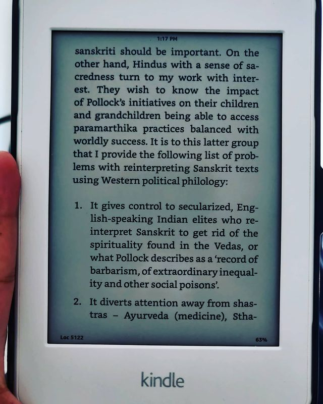
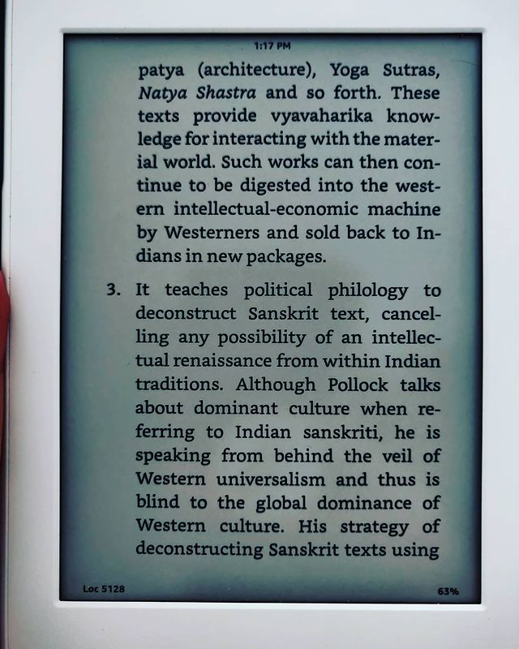

The Battle for Sanskrit by Rajiv Malhotra

> ** The blatant attacks on a beautiful language in the guise of "reviving" it, in the academic sphere after killing it in the public sphere. What are the hidden motives behind such attacks, what is the agenda? **

