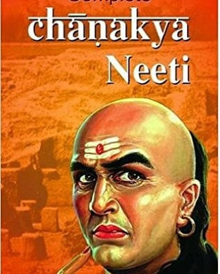
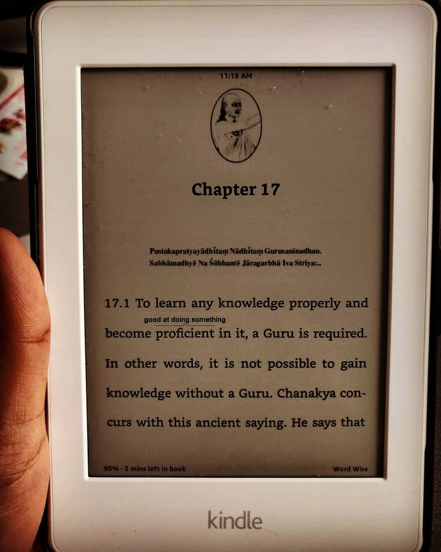
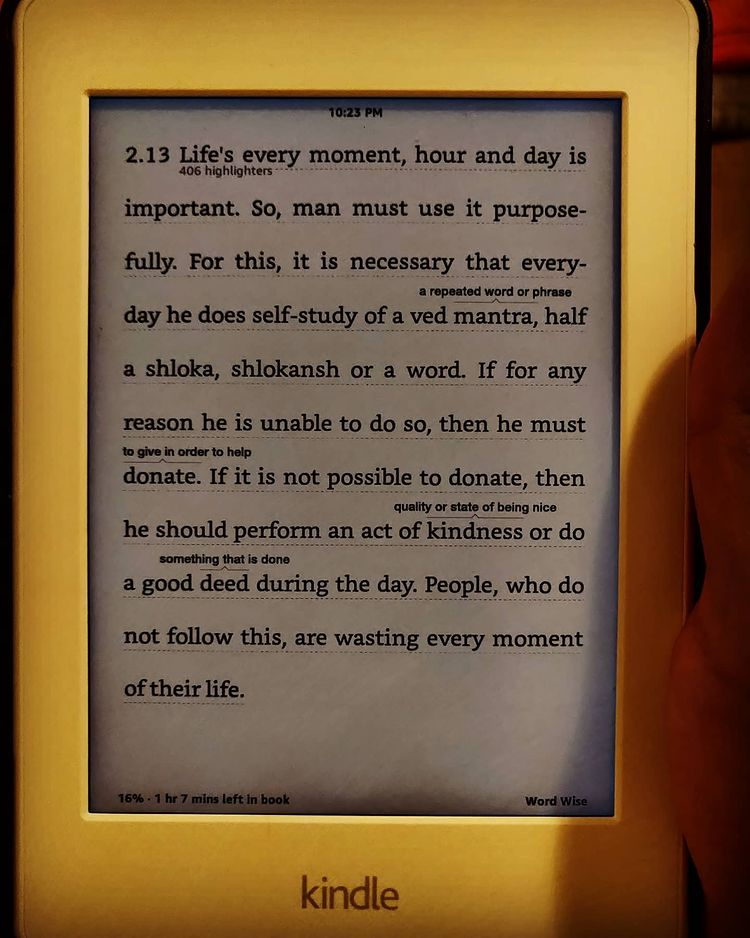

Chanakya Neeti by Chanakya translated by R.P. Jain

> ** A compilation of glorious Indic wisdom delivered in a prosaic structure from the genius mind of Chanakya. Although, cluttered with shoddy mistranslations of the original Sanskrit writing and requiring some effort to map ideas to the contemporary world/society. **

