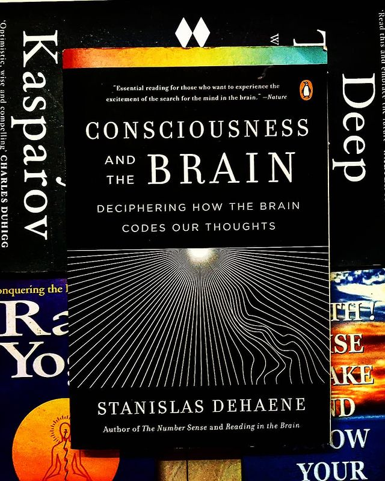

Consciousness and the brain by Stanislas Dehaene

> ** What is consciousness? What is unconsciousness? What can they do? Where is the distinction between them? Who/what sits in the throne of the mind? What did evolution do to it? Understand the answers to these questions elucidated from a neurological POV as you, humorously, develop trust issues with your brain! **