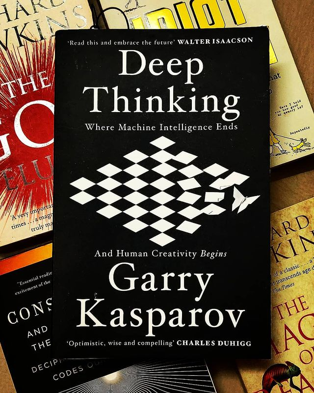

Deep Thinking : Where Machine Intelligence Ends And Human Creativity Begins by Garry Kasparov

> ** Garry Kasparov takes the reader through a journey through the events that led to the development of "Deep Mind" - a chess program, which he eventually lost to. Simultaneously giving a commentary on the possibilities and proposed limitations of artificial intelligence, machine learning and human creativity! **