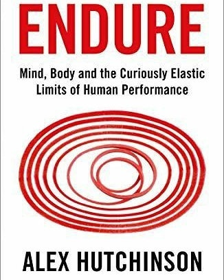
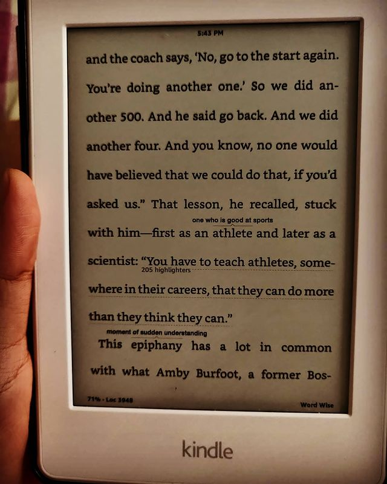

Endure: Mind, Body, and the Curiously Elastic Limits of Human Performance by Alex Hutchinson

> ** A sojourn through the variables that are responsible for "endurance" of the human physiology. Identifying the limits of human physical abilities and exploring/venturing beyond, resulting in some pretty surprising conclusions. **

