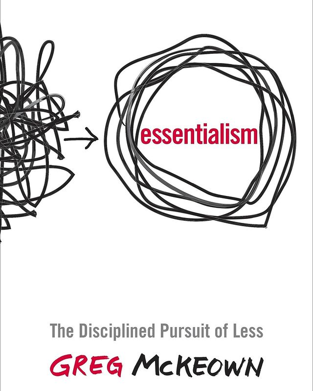
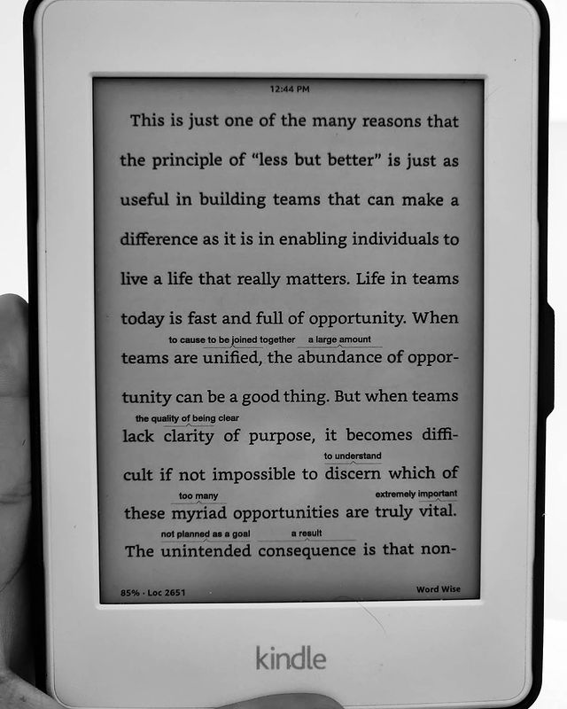

Essentialism by Greg McKeown

> ** Essentialism as a philosophy somewhere in between minimalism and extravagance. Generic methods, almost bordering on cliche, to, subjectively, declutter and add synergistic structure to life. **

