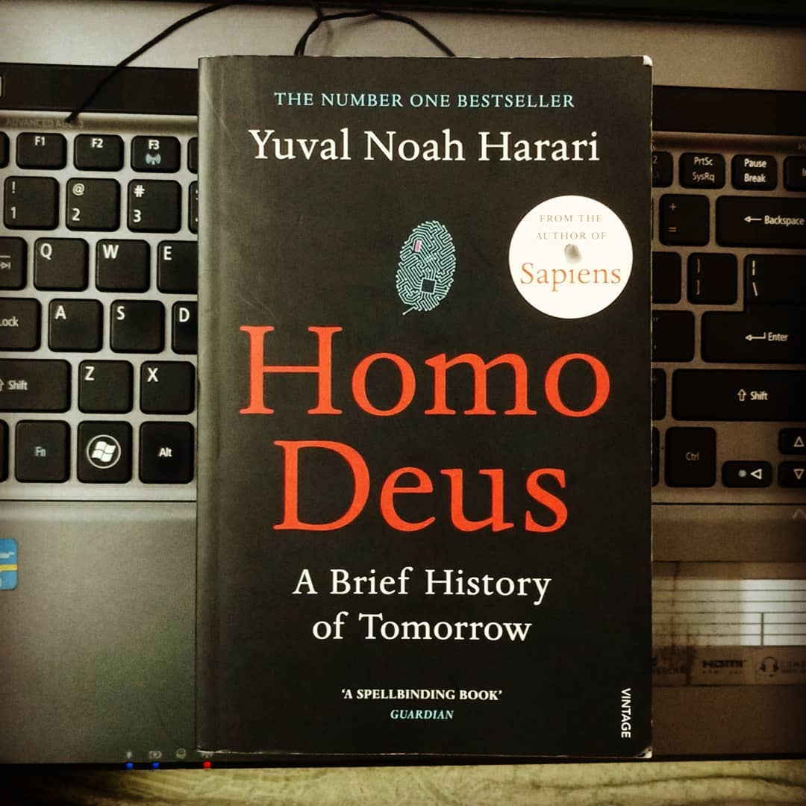

Homo Deus - A Brief History of Tomorrow by Yuval Noah Harari

> ** What after homo sapiens? Visualising and contemplating the progression of humanity through a conglomeration of social, political, cultural and scientific lenses. **