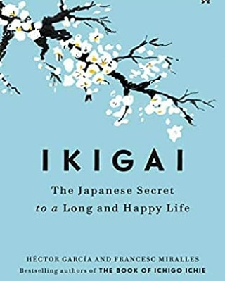
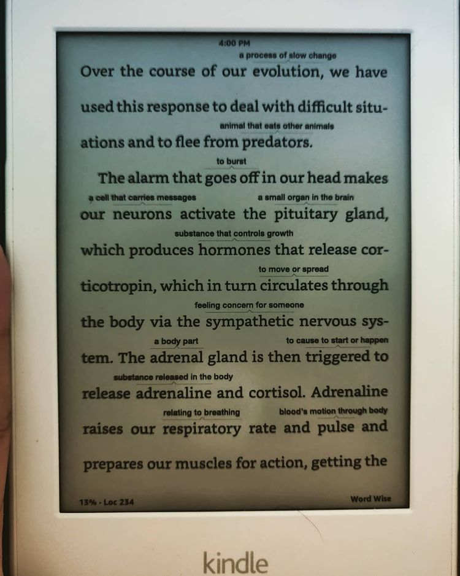
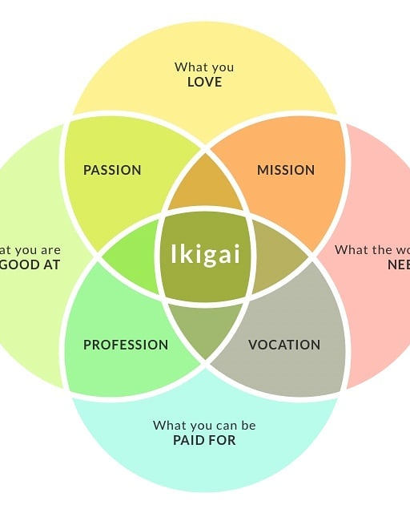

Ikigai: The Japanese Secret to a Long and Happy Life by Albert Liebermann & Hector Garcia

> ** Ikigai - the thing that makes you get up off your bed every morning and fuels your life. Ikigai = Mission + Passion + Vocation + Profession; Quick read to help you find your Ikigai. **

