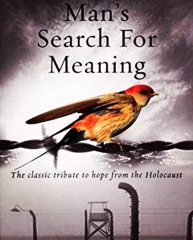
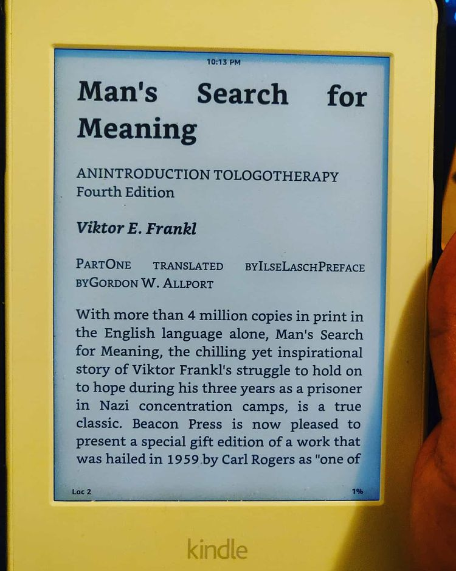
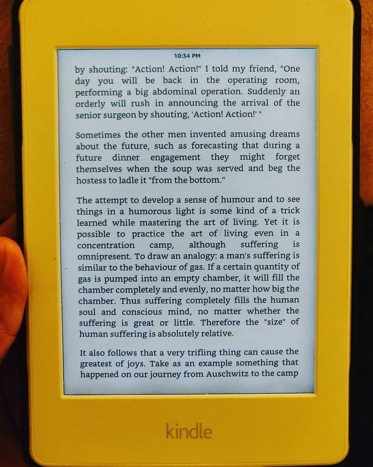

Man's Search for Meaning by Viktor Frankl

> ** What does it mean to truly live life? What gives it it's meaning? A window into the effects of the holocaust from a psychological point-of-view; also, "logotherapy". **

