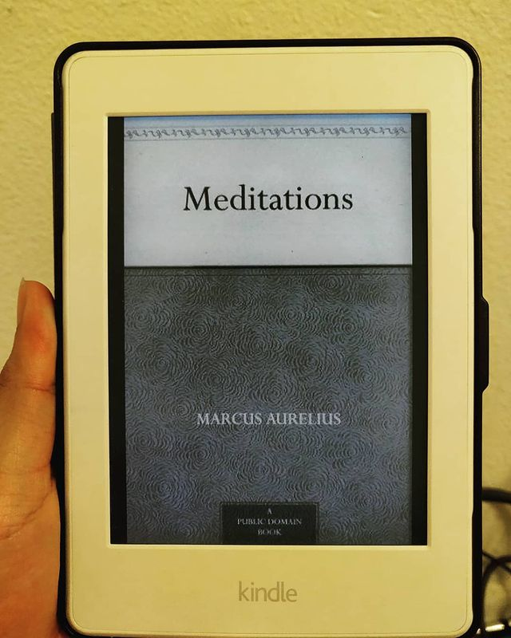

Superintelligence by Nick Bostrom

> ** A collection of notes in a pithy paragraph style written in old English encompassing the essence and soul of stoicism. Stoicism - the beautiful philosophy which finds its roots in the Bhagavad Gita. **

