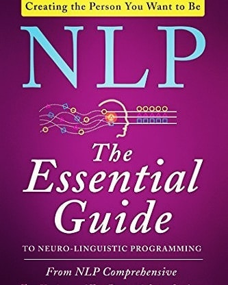

NLP: The Essential Guide to Neuro-Linguistic Programming by Tom Dotz

> ** How does the mind "perceive" the "reality"? How does it "process" it? Is there a "framework", an "operating system" of the brain? Understand how to "hack" the "data processing cycle" of the brain! **

