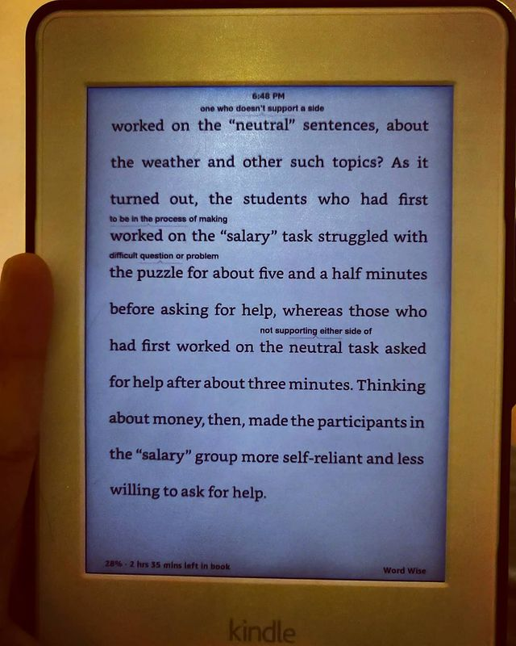

Predictably Irrational by Dan Ariely

> ** A seminal analysis of our "decision making systems" - it's components, it's functions, factors that can influence it. The decisions we make (and term) as "rational" - are they truly rational or is there more to it? **

