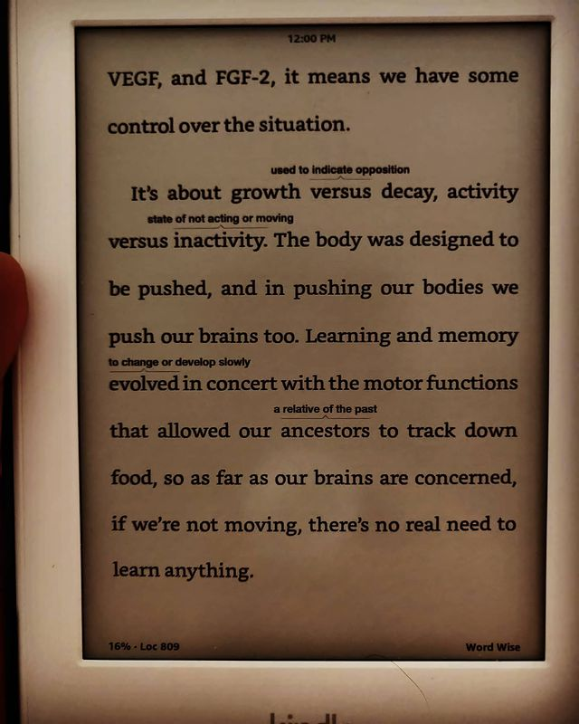

Spark: How exercise will improve the performance of your brain by John Ratey & Eric Hagerman

> ** Postulating exercise as a, limitless-esque (the movie), super pill. Research backed commentry on exercise; carting through the various avenues of benefits it ushers. **

