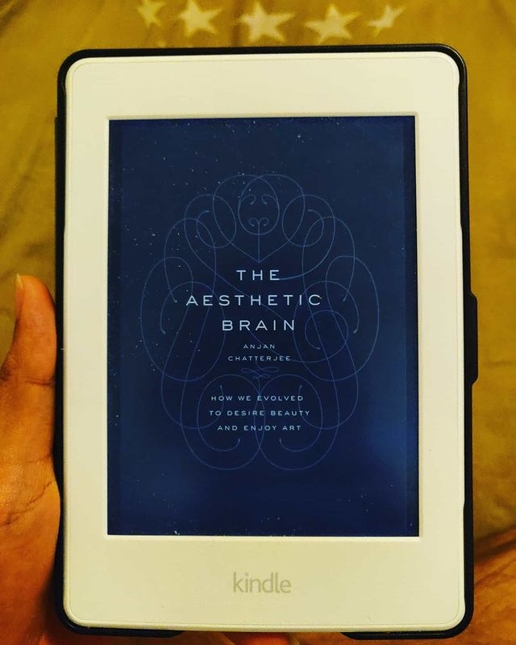
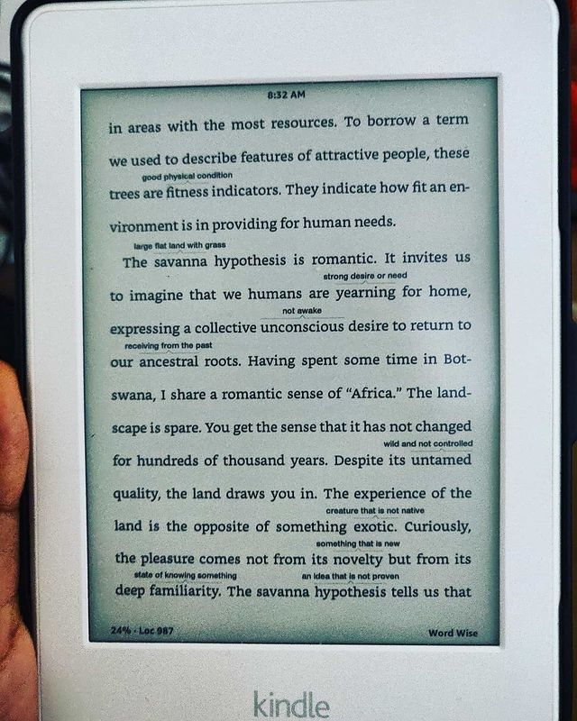

The Aesthetic Brain: How we evolved to desire beauty and enjoy art by Anjan Chatterjee

> ** What does it mean to have an "aesthetic experience" (aka रस - "rasa")? [what makes flowers "beautiful"?, why is the sight of mountains pleasing?,]. Understand it's (it = aesthetic experience) various tenets - music, smell, taste, sex, sight, etc from an evolutionary, neurological perspective. **

