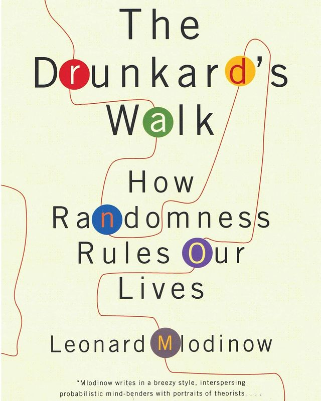
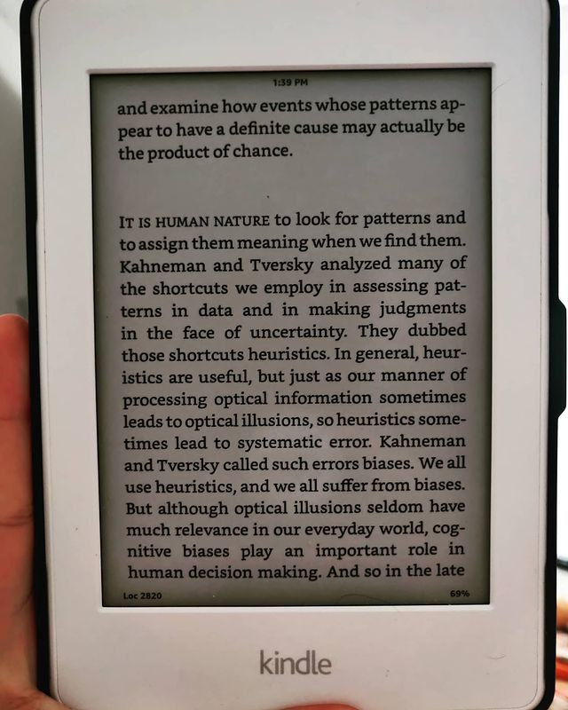

The Drunkard's Walk: How Randomness Rules our Lives by Leonard Mlodinow

> ** An ode to statistics and probability in everyday life. Grokking numbers, probabilities (priors, posteriors) from first principles and concluding in an amalgamation of chaos theory and the butterfly effect titled "the Drunkards walk". **

