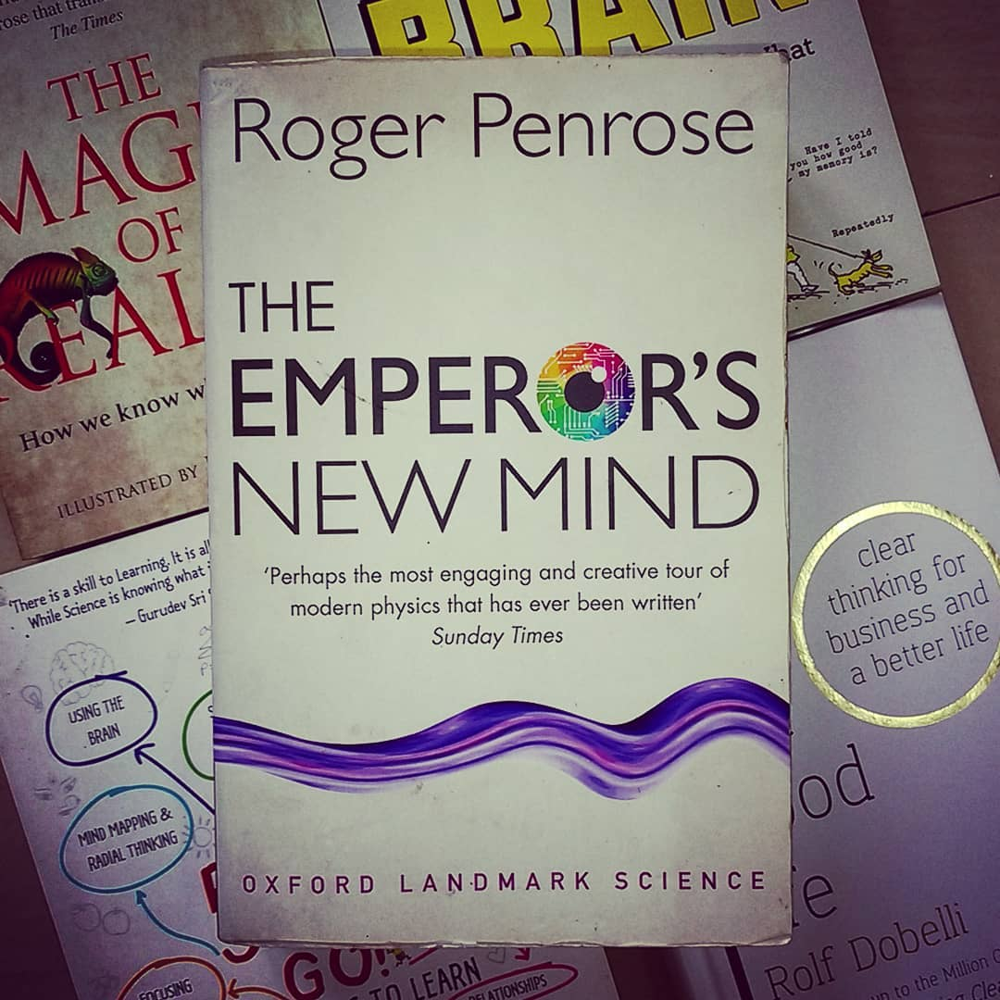

The Emperor's New Mind by Roger Penrose

> ** A rigorous, mind-bending arduous journey encompassing a path through Turing machines, algorithms & computability, black holes, Hilbert spaces, Mandelbrot sets, quantum mechanics, brains, consciousness reducing down to an attempt at understanding and speculating the non-algorithmic nature of the mind. Remarkably raises more questions than answered that one feels compelled to ponder about. **