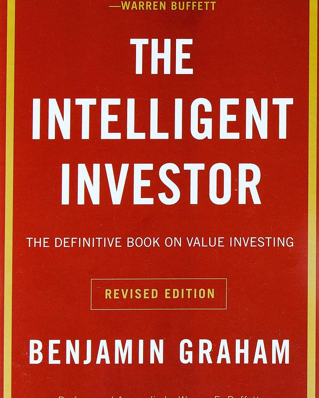

The Intellegent Investor by Benjamin Graham

> ** A mini-3XX course on investing and the stock market; provides a framework for investing "intelligently" (author was Warren Buffett's mentor). An arduous read - assumes the fundamentals to be already understood by the reader, nevertheless a must read prior to investing **

