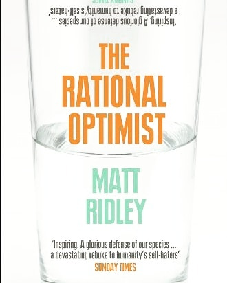
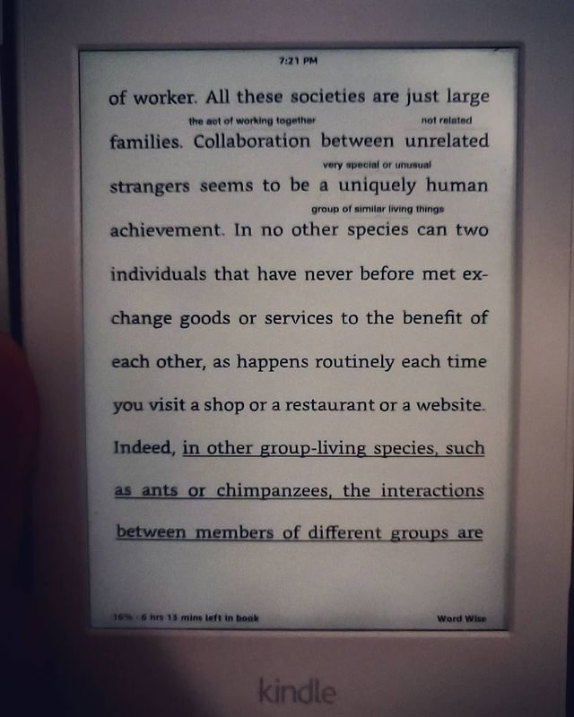
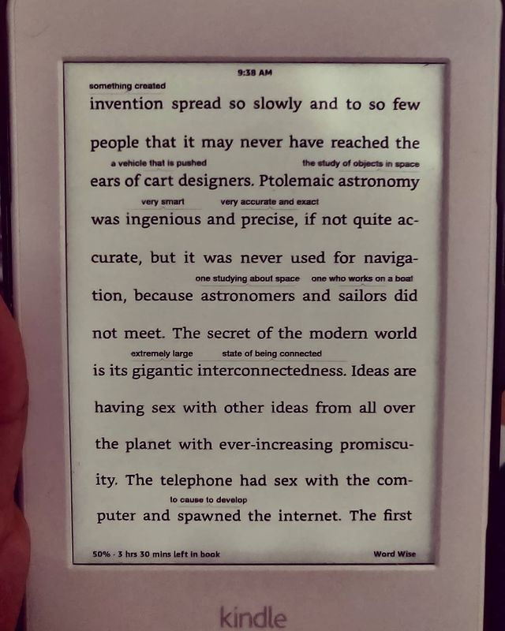

The Rational Optimist by Matt Ridley

> ** A sojourn through the socio-politico-ecnomico-cultural dynamics of the world and its co-influence on rational thought, its complexities and costs. The evolutionary origins of rationality contributing to the "human experience", and other systems such as the barter system (observing it's absence in the animal kingdom) - discussing it as a possible "emergent" property of homo sapiens aka a "collective intelligence". **

