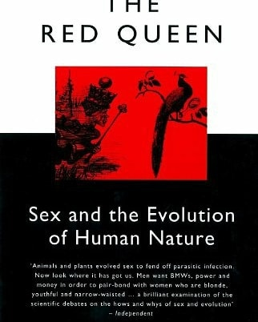
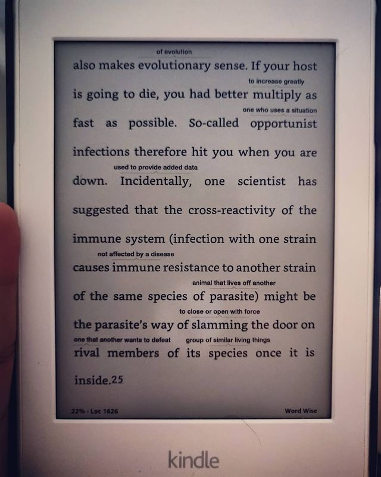
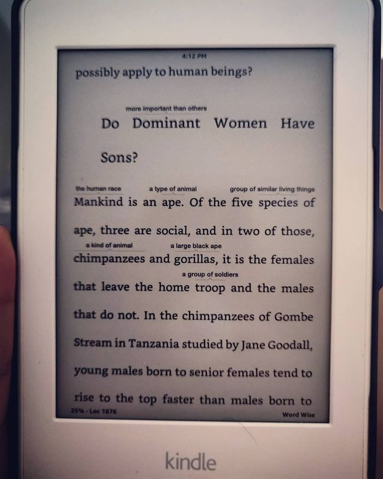
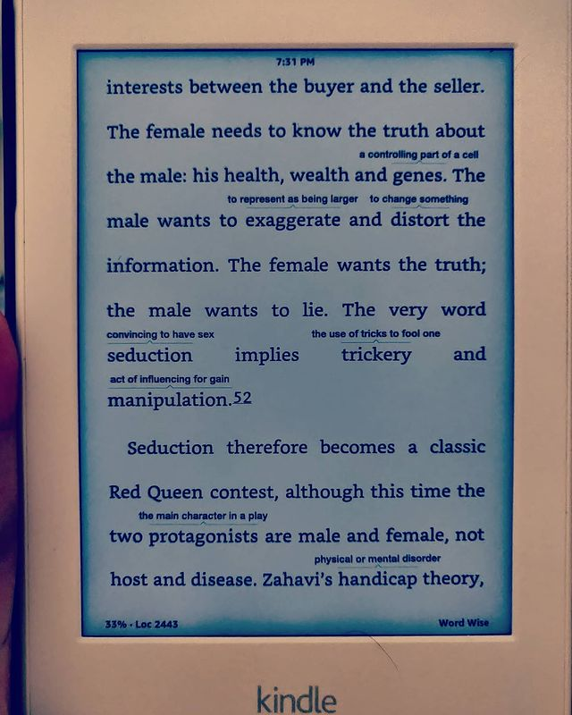
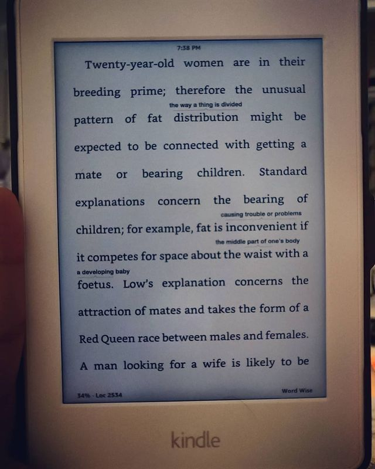
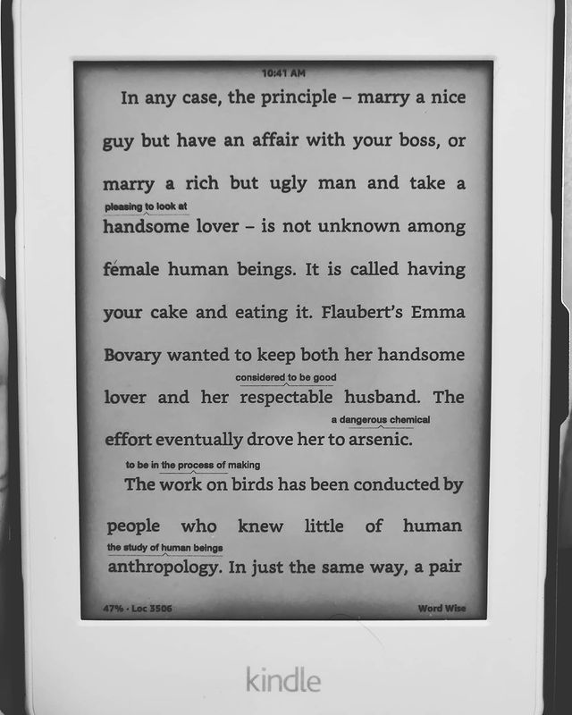
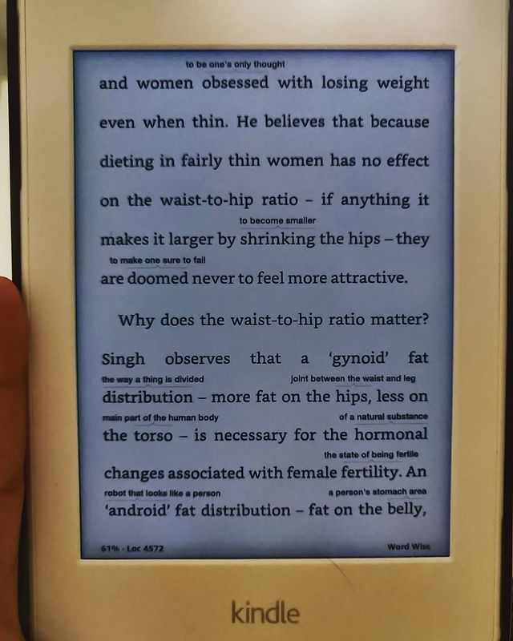

The Red Queen by Matt Ridley

> ** Found yourself attracted to a member of the opposite sex (or same if you swing that way) sex? Find out why, in painfully amazing detail. A truly eye opening take and analysis on sex, viruses (or parasites in general), immunity, evolution and their mechanics, purpose and interdependence. **

