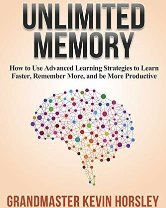
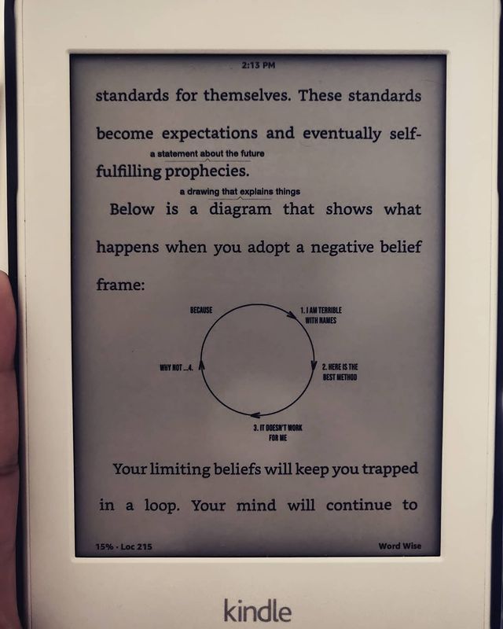
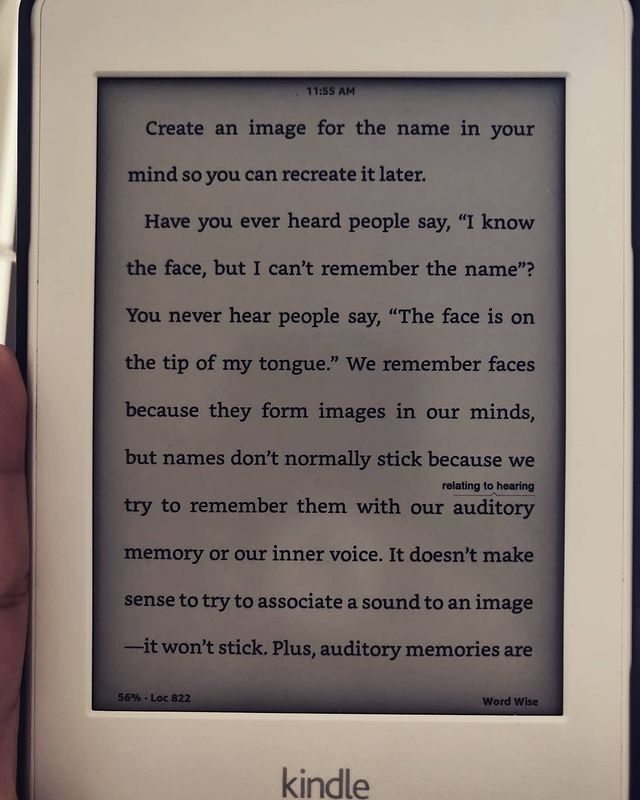
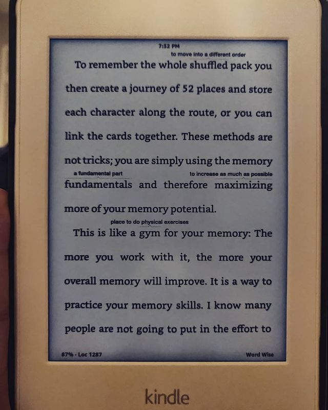

Unlimited Memory by Kevin Horsley

> ** Simple, easy, fun techniques/mental tools to improve memory. We have "bad memory" not because we have bad memory but because of a general lack of "indexing" of the memory - understand how you can leverage multivariate indexing to make stronger neurological connections (akin to improved memory) using real world scenarios. **

