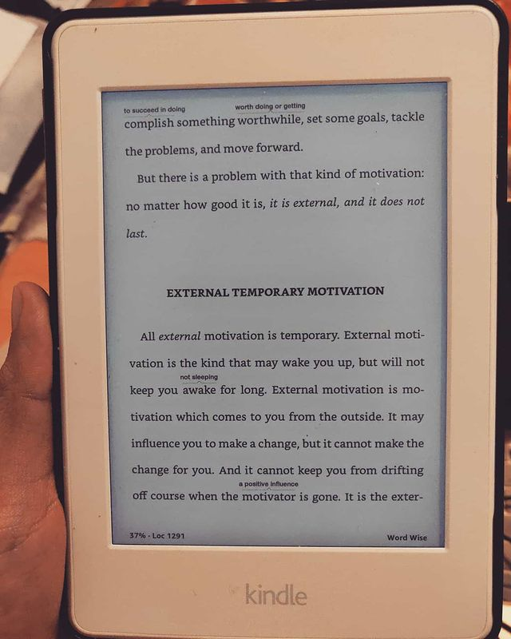

What To Say When You Talk To Yourself by Shad Helmstetter

> ** The human physiology is the hardware and 'we' write it's software. Learn one of its many programming languages - "self talk", to take advantage of your brain's neuroplasticity and supercharge your life! **

